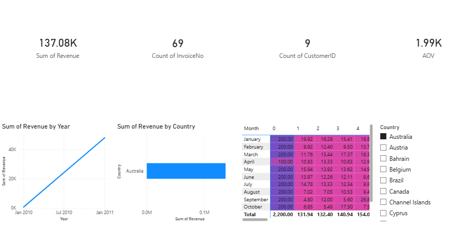

# Data Analytics Internship – ApexPlanet

## Author: Jinal Patel

---

## Project Overview

This repository contains my complete work for the ApexPlanet Data Analytics Internship. The project demonstrates an end-to-end data analytics workflow including data cleaning, exploratory data analysis (EDA), SQL-based business insights, deep-dive analysis, interactive dashboarding, and data storytelling.

The goal of this project is to analyze an online retail dataset to uncover patterns, understand customer behavior, and support data-driven business decisions.

---

## Tasks Completed

### Task 1: Data Cleaning & Wrangling

* Cleaned raw dataset using Python (Pandas)
* Handled missing values, duplicates, and inconsistent data formats
* Removed invalid entries (negative quantity, incorrect pricing)
* Created a structured and analysis-ready dataset

---

### Task 2: Exploratory Data Analysis (EDA) & Business Intelligence

* Performed descriptive and statistical analysis
* Generated insights using Python visualizations (histograms, bar charts)
* Answered business questions using SQL queries
* Designed a static dashboard mock-up for KPI tracking

---

### Task 3: Deep Dive Analysis & Interactive Dashboard

* Defined key KPIs using SQL:

  * Total Revenue
  * Total Orders
  * Total Customers
  * Average Order Value (AOV)
  * Customer Retention Rate
* Performed "Cohort Analysis" to study customer retention patterns
* Built an interactive dashboard using Power BI to visualize:

  * Revenue trends
  * Country-wise performance
  * Customer retention heatmap

---

### Task 4: Data Storytelling & Statistical Validation

* Created a business presentation using PowerPoint
* Converted analysis into a structured data story
* Performed hypothesis testing using Python (T-test)
* Derived actionable business insights and recommendations

---

## Dashboard Preview

---

## Tools & Technologies Used

* Python (Pandas, NumPy, Matplotlib)
* SQL (PostgreSQL)
* Power BI
* Excel
* Jupyter Notebook

---

## Key Insights

* Revenue shows a consistent increasing trend over time
* United Kingdom contributes the highest share of total revenue
* Customer retention declines after the first purchase
* Average Order Value reflects customer spending behavior
* Repeat customers significantly impact business growth

---

## Statistical Analysis

* Conducted hypothesis testing using Python
* Compared revenue across different months
* Validated business assumptions using statistical methods

---

## Conclusion

This project demonstrates a complete data analytics lifecycle—from raw data processing to business insights and visualization. By combining Python, SQL, and Power BI, meaningful insights were generated to support strategic decision-making.

---

## Acknowledgement

This project was completed as part of the ApexPlanet Data Analytics Internship program.

---
